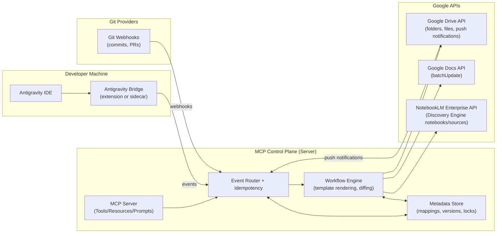
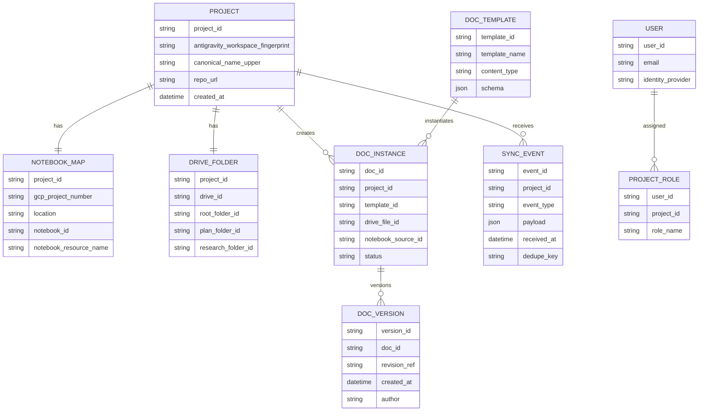
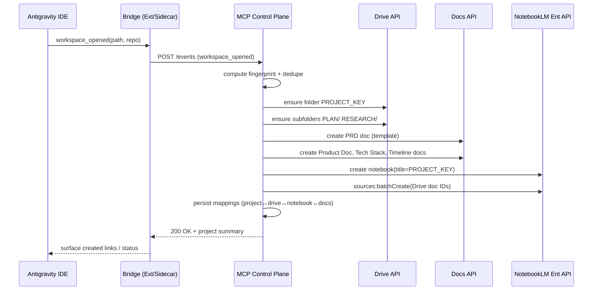
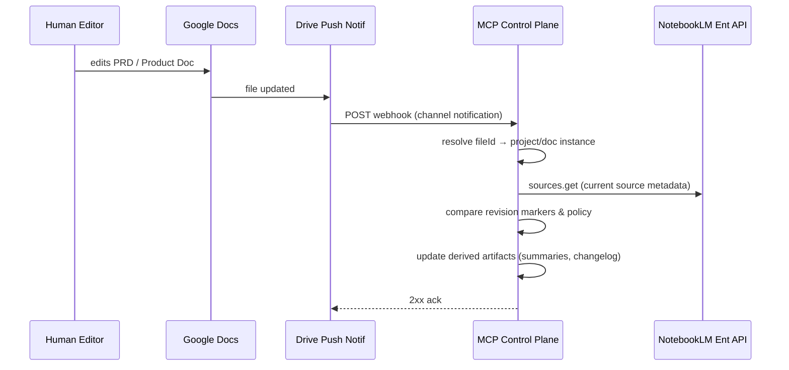

# Designing an MCP Control Plane Server for Google Antigravity IDE and NotebookLLM

## Executive Summary

This report designs an MCP (Model Context Protocol)–compatible “middleware control plane” server that bridges **Google Antigravity IDE** (agentic IDE + MCP client surface) with **NotebookLLM** (best mapped today to **NotebookLM Enterprise**, because it has an official, programmatic API). Antigravity’s practical integration surface is MCP: Antigravity can reference MCP servers as context and install MCP servers via an in-product UX (MCP Store) rather than requiring developers to wire bespoke integration code into the IDE. citeturn1view4turn5view2 NotebookLM Enterprise exposes REST APIs under the Discovery Engine endpoint to create notebooks, add sources, share, and manage related functionality, with enterprise IAM and identity options. citeturn6view0turn6view1turn9view2

A key design finding is that **NotebookLM Enterprise does not provide a “folder” primitive in its API**; it provides **notebooks** (containers of sources). citeturn6view0turn15view0 Therefore, to satisfy “project folder + document creation” requirements, the most robust approach is a **dual-structure**:

- **Project “folder” = a Google Drive folder tree** (uppercase-named root + nested `PLAN/` and `RESEARCH/`), with PRD and product docs stored as Google Docs/Markdown/PDF artifacts.
- **Project “workspace in NotebookLLM” = a NotebookLM Enterprise notebook**, with those Drive docs (and any other sources) added as notebook sources using the NotebookLM Enterprise sources API. citeturn6view1turn9view1turn17search0

Automation is driven by **events** from (a) Antigravity project/workspace lifecycle, (b) Git provider events (commits / PRs), and (c) Drive change notifications for “manual edits” to docs. Drive has first-class push notifications (“webhooks”) for changes to files/changes resources, enabling low-latency doc sync triggers without polling. citeturn17search0turn17search12

The recommended implementation is an **event-driven control plane** with strong idempotency, deterministic naming, and explicit governance over which doc sections are auto-managed vs. human-managed. NotebookLM Enterprise’s usage limits (e.g., notebooks per user, sources per notebook, queries/day) and administrative controls (IAM roles, identity provider configuration, audit logging) must be treated as first-order constraints in the design. citeturn9view1turn9view2turn9view3

## Platform Surfaces, APIs, and Authentication

### Google Antigravity IDE integration surface

Antigravity is positioned as an “agent-first” development platform with a dedicated manager surface for orchestrating agents, plus a familiar editor view. citeturn3view1turn5view0 In public preview, it is locally installed and (per the official codelab) initially available to personal Gmail accounts with a free quota for models. citeturn1view5turn4search14

**Practical control hooks you can rely on (officially documented):**

- **Workspaces + local folders**: Antigravity workspaces map to local folders similar to VS Code, which is the core “project boundary” you can detect. citeturn5view0  
- **File-based “Rules” and “Workflows”**: Antigravity supports system-instruction-like “Rules” and saved-prompt-like “Workflows,” which can be scoped globally or per workspace. Paths are explicitly documented: global rule `~/.gemini/GEMINI.md`, global workflows under `~/.gemini/antigravity/...`, and workspace rules/workflows under `your-workspace/.agent/rules/` and `your-workspace/.agent/workflows/`. citeturn5view1turn5view3  
- **MCP server context**: In the agent chat, `@` can include context such as files, directories, and **MCP servers**. citeturn5view2  
- **MCP Store / in-product installation**: Google Cloud’s blog explicitly describes MCP servers (including Google’s MCP Toolbox for Databases) available inside Antigravity and installable via a UI-driven “MCP Store,” with credentials stored securely and optional IAM-based access. citeturn1view4  

**Rate limits:** Public reporting notes “generous” rate limits that refresh on a fixed cadence (reported as every five hours) and that only a small fraction of heavy users hit them. citeturn3view2 This matters operationally: your integration should avoid designs that require high-frequency “agent calls” to your MCP server during bursts.

**What is *not* reliably documented publicly:** a stable, supported “Antigravity Projects API” (HTTP endpoints/webhooks) for programmatic listing of workspaces or project creation events. In practice, you should assume you need one of:
- an Antigravity extension (VS Code–style) to detect workspace lifecycle locally, or  
- a file-system watcher/sidecar that infers “new project” from local folder patterns.

The rest of this report designs around those constraints.

image_group{"layout":"carousel","aspect_ratio":"16:9","query":["Google Antigravity IDE Agent Manager screenshot","Google Antigravity MCP Store screenshot","NotebookLM Enterprise interface screenshot","NotebookLM notebook interface screenshot"],"num_per_query":1}

### NotebookLLM mapped to NotebookLM Enterprise API surface

NotebookLM Enterprise is documented as an enterprise-ready form of NotebookLM, running within a Google Cloud project and offering stronger compliance and administrative controls (e.g., VPC-SC, CMEK, data residency, IAM). citeturn9view1turn18view0 It also documents explicit **usage limits** (e.g., 500 notebooks per user, 300 sources per notebook, 500 queries per user per day). citeturn9view1

#### Core REST endpoints and methods

NotebookLM Enterprise management is exposed via the Discovery Engine API. Setup explicitly requires enabling the Discovery Engine API in your Cloud project. citeturn9view2

Key notebook operations include:
- `POST .../notebooks` (create) citeturn7search0  
- `GET .../notebooks/NOTEBOOK_ID` (retrieve) citeturn6view0  
- `GET .../notebooks:listRecentlyViewed` (list recently viewed; up to 500 default) citeturn6view0  
- `POST .../notebooks:batchDelete` (delete) citeturn6view0  
- `POST .../notebooks/NOTEBOOK_ID:share` (share) citeturn6view0  

Adding sources is performed by:
- `POST .../notebooks/NOTEBOOK_ID/sources:batchCreate` (batch add sources, supporting Google Drive Docs/Slides, text, web URLs, YouTube, and file upload flows) citeturn6view1turn15view0  

**Important constraint:** The NotebookLM Enterprise sources REST resource documents only `batchCreate`, `batchDelete`, and `get`—there is no “update/refresh source” method in the public API reference. citeturn15view0 This is central to sync strategy: “refresh” generally means “delete and re-add,” or treat the Drive doc as canonical and accept that the notebook source snapshot might lag.

#### Identity and authentication models

NotebookLM Enterprise setup requires configuring an identity provider in Google Cloud. Supported frameworks include:
- Cloud Identity (including cases where a third-party IdP is synced into Cloud Identity),
- Workforce Identity Federation for external IdPs using OIDC or SAML 2.0 (no identity sync required), with explicit attribute mapping requirements (e.g., `google.subject` mapping to email). citeturn9view2  

Operationally, NotebookLM Enterprise API examples use OAuth-style bearer tokens (e.g., `Authorization:Bearer $(gcloud auth print-access-token)`). citeturn6view0turn6view1 Sharing requires that target users have been granted the “Cloud NotebookLM User” role, and notebook sharing roles include `PROJECT_ROLE_OWNER`, `PROJECT_ROLE_WRITER`, and `PROJECT_ROLE_READER`. citeturn6view0turn18view2

NotebookLM Enterprise also makes strong statements about data placement and lifecycle (data stored in project multi-region; deletion of notebook deletes data; deletion of project deletes all data). citeturn9view1

#### Webhooks / eventing

NotebookLM Enterprise’s public API docs do not describe “webhooks” for notebook/source changes. citeturn15view0turn6view0 For “manual edits” to documents, the proper event surface is **Google Drive**:

- Drive supports push notifications to a webhook receiver for changes, so your control plane can react to document modifications. citeturn17search0turn17search12  

#### Rate limits and quotas

NotebookLM Enterprise has explicit per-user and per-notebook usage limits (notebooks, sources, queries/day, source size, etc.). citeturn9view1 Drive API documents per-minute query limits, and the patterns of `403: User rate limit exceeded` and occasional `429: Too many requests`, with an expectation to implement exponential backoff. citeturn17search2

### Comparison tables

#### Integration approaches

| Approach | Antigravity touchpoint | NotebookLLM touchpoint | Strengths | Weaknesses | Best fit |
|---|---|---|---|---|---|
| IDE-driven MCP tools (recommended) | Antigravity agent calls MCP tools (plus optional extension for auto-trigger) citeturn5view2turn1view4 | NotebookLM Enterprise REST APIs citeturn6view0turn6view1 | Natural fit for Antigravity’s MCP-first workflow; centralized governance; auditable | Requires careful permissions + idempotency; notebook source refresh limited citeturn15view0 | Teams living inside Antigravity, wanting tight agent workflows |
| Git-first automation (webhook pipelines) | Minimal IDE dependency | NotebookLM + Drive/Docs updates | Reliable triggers for commits/PRs; easy to scale | Weaker connection to “new project in IDE”; may miss non-git events | Repo-centric orgs, CI/CD maturity |
| Drive-folder–centric “project hub” | Optional; IDE just references docs | NotebookLM notebook is a view over Drive docs | Clear “folder” semantics; easy manual browsing | NotebookLM notebook becomes derivative/snapshot; must manage staleness citeturn15view0turn17search0 | Documentation-first orgs |
| Manual workflows (lowest automation) | User triggers Antigravity workflows in `.agent/workflows` citeturn5view1turn5view3 | Manual notebook creation | Lowest complexity | Not a control plane; inconsistent outcomes | Early prototypes only |

#### Authentication methods

| Method | Where used | Pros | Cons / risks | Notes |
|---|---|---|---|---|
| User OAuth / user credentials | Drive/Docs access; adding Drive docs as notebook sources sometimes requires user credentials citeturn6view1turn17search0 | Fine-grained user-level access; aligns with doc ownership | Token lifecycle complexity; least-privilege scope design needed | NotebookLM Enterprise docs explicitly call out Drive authorization steps when using Drive sources. citeturn6view1 |
| Enterprise IAM roles | NotebookLM Enterprise access/sharing citeturn18view2turn6view0 | Strong admin control; revocable; auditability | Requires upfront admin work (roles + licensing) citeturn9view2turn19search13 | Users must be in same project/workforce pool for sharing. citeturn18view2 |
| Workforce Identity Federation | Enterprise SSO for NotebookLM Enterprise access citeturn9view2 | No user identity sync required; works with OIDC/SAML IdPs | More complex setup; attribute mapping requirements | Docs call out federation + mappings as required in that setup. citeturn9view2 |
| Credentialless “IDE token reuse” | Antigravity internal model auth | Simplifies dev UX | Not a supported enterprise integration surface; avoid depending on private endpoints | Antigravity’s reliable extension point for integrations is MCP. citeturn1view4turn5view2 |

## Control Plane Architecture

### Architectural goals

The control plane must:
- deterministically map Antigravity “projects” (workspaces) to a canonical documentation set (Drive folder tree + NotebookLM notebook),
- synchronize events from code and docs into structured documents (PRD, product docs, plans, research),
- ensure safe multi-user collaboration (permissions, auditing, conflict rules),
- remain robust under quota/rate-limit constraints (NotebookLM limits; Drive per-minute quotas). citeturn9view1turn17search2  

### Recommended high-level architecture

The design uses three planes:

**Plane A: IDE ingestion (Antigravity → control plane)**  
A lightweight local “Antigravity bridge” (extension or sidecar) emits normalized events:
- `workspace_opened`, `workspace_initialized`
- `feature_started`, `feature_completed` (optional; derived from branch naming conventions)
- `manual_sync_requested`

Antigravity’s file-based rules/workflows paths (`.agent/rules`, `.agent/workflows`) provide a deterministic place to store a per-project configuration and a bootstrap token/endpoint reference for the bridge. citeturn5view1turn5view3

**Plane B: Control plane core (MCP server + event processor)**  
The MCP server exposes tools/resources/prompts per the MCP spec:
- Tools: `ensure_project_space`, `ensure_doc_templates`, `sync_from_git_event`, `sync_from_drive_change`, `rebuild_prd_section`, etc. MCP tools are a first-class concept in the spec, defined with schemas, allowing clients to discover and invoke them. citeturn16search8turn16search1  
- Transport: choose Streamable HTTP when operating as a shared remote service; MCP supports stdio and Streamable HTTP as standard transports. citeturn16search35  
- Versioning: implement MCP spec revision pinning (e.g., `2025-11-25`) and server capability negotiation. citeturn16search20turn16search1  

**Plane C: Downstream execution (Drive/Docs + NotebookLM Enterprise + Git)**  
- Drive creates and owns the folder structure and Docs content.
- NotebookLM Enterprise notebook is created and receives sources that reference those Drive docs (and optionally other sources like URLs). citeturn6view1turn7search0  
- Drive push notifications trigger “manual edit” synchronization. citeturn17search0turn17search12  

### Component diagram (Mermaid)



### Data model (ER diagram)



## Event Flows, Detection Logic, and Scalability

### Detecting “new projects” in Antigravity

Because the publicly documented primitives are **workspaces (folders)** and `.agent/` configurations, the most robust detection logic is:

1. **Workspace fingerprint**: compute `workspace_fingerprint = hash(abs_path + repo_remote + optional_antigravity_workspace_id)` (exact makeup is implementation-defined; the goal is stability).  
2. **Bootstrap marker**: check for `.agent/your-control-plane.json` (or similar) inside the workspace; Antigravity already uses `.agent/rules/` and `.agent/workflows/` for workspace-scoped behavior. citeturn5view1turn5view3  
3. **Server lookup**: call `GET /projects/byFingerprint/{fingerprint}` on the control plane; if not found, treat as new.  
4. **Naming**: derive a canonical project name from repo name or folder name, apply normalization, then enforce `UPPERCASE` naming for the Drive root folder and the NotebookLM notebook title.

This approach is resilient to renames and avoids needing undocumented Antigravity network APIs.

### Uppercase folder rule

When a project is registered or opened:

- Canonical name: `CANONICAL = normalize(name)`  
- Uppercase key: `PROJECT_KEY = CANONICAL.toUpperCase()`  
- Ensure Drive structure:
  - `/{PROJECT_KEY}/PLAN/`
  - `/{PROJECT_KEY}/RESEARCH/`
- Ensure NotebookLM notebook titled exactly `{PROJECT_KEY}` exists in control-plane mapping DB; if missing, create it.

NotebookLM Enterprise’s API supports notebook creation, retrieval, and sharing, but does not provide a “list all notebooks” API—only “recently viewed” listings are explicitly documented. citeturn6view0turn7search0 Therefore, “existence checks” should be via your own mapping DB + occasional `notebooks.get` validation.

### Sequence diagram: new project bootstrap



Notebook creation and sources batchCreate follow the documented Discovery Engine endpoints and structures. citeturn6view0turn6view1

### Sequence diagram: manual doc edit sync via Drive push notifications



Drive push notifications require setting up a webhook receiver and use POST callbacks when watched resources change. citeturn17search0turn17search12 NotebookLM Enterprise sources include metadata such as Google Docs `documentId` and `revisionId`, which can be stored as part of version tracking. citeturn14view0turn15view0

### Scalability and fault tolerance considerations

- **Rate limiting and backoff**: Drive documents both quota errors (`403`) and backend rate-limit (`429`) patterns and explicitly recommends exponential backoff. citeturn17search2 Your worker should apply retry with jitter and use an internal token bucket per upstream API.  
- **NotebookLM limits**: enforce hard guards before writes (e.g., sources per notebook) based on documented limits. citeturn9view1  
- **Idempotency**: every external creation call must be keyed (e.g., deterministic “dedupe_key” based on `{project_id}:{template_id}:{target}`) so retries don’t multiply documents or sources.  
- **Event replay**: persist all inbound events and processing outcomes for replay, because Drive push notifications and Git webhooks are ultimately “at least once” delivery patterns in practice (design should assume duplicates). The Drive push model is asynchronous notifications to your receiver. citeturn17search0  
- **Observability hooks**: NotebookLM Enterprise provides project-level observability settings that log request/response data (including prompts/grounding metadata) to Cloud Logging, but warns that sensitive data is not filtered out. citeturn9view3 This is useful but must be gated carefully.

## Document System: Templates, Schemas, and Auto-Updating PRD

### Folder and document taxonomy

**Drive folder tree (canonical):**
- `PROJECT_KEY/`
  - `PLAN/`
    - `PRD` (Google Doc)
    - `PRODUCT_DOC` (Google Doc or Markdown)
    - `TIMELINE` (Google Sheet or Doc)
    - `RELEASE_NOTES` (Markdown)
  - `RESEARCH/`
    - `PROBLEM_RESEARCH` (Doc)
    - `COMPETITOR_RESEARCH` (Doc)
    - `USER_INSIGHTS` (Doc)
    - `PLAN_GENERATION_LOG` (Markdown)
  - (optional) `TECH/`, `ADR/`, `MEETINGS/`

**NotebookLM notebook (derived view):**
- Notebook titled `PROJECT_KEY`
- Sources: all docs above + optionally URLs, YouTube, PDFs, etc. (supported in sources APIs) citeturn6view1turn9view1

NotebookLM’s own Help Center framing supports the mental model “one notebook per project,” where a notebook is a collection of sources for a specific project. citeturn7search24

### Template comparison table

| Template | Primary purpose | Core sections (minimum) | Auto-updated blocks | Sync triggers |
|---|---|---|---|---|
| PRD | Single source of truth for “what/why/success” | Problem, Goals/Non-goals, Users, Requirements, Metrics, Risks, Launch | “Status,” “Scope delta,” “Decision log,” “Open questions,” “Implementation progress” | New feature branch, merged PR, release, manual PRD edit |
| Product Doc | Team-facing reference | Feature catalogue, Tech stack, Stakeholders, Timelines, Dependencies | “Feature status grid,” “Dependency matrix,” “Timeline rollups” | Commits/PRs, dependency updates, manual edits |
| Plan | Execution plan for next increment | Milestones, tasks, owner, acceptance criteria | Entire doc may be regenerated, but preserve “human notes” | New epic/feature start; manual “regenerate plan” |
| Research | Evidence base | Sources, findings, implications, unknowns | “Summary of last 7 days changes,” “open research questions” | New research added, new external sources, manual edits |

### Managing “auto-updating” while preserving human edits

Because Docs and PRDs are collaboratively edited, the control plane should create **explicitly delimited managed sections**, e.g.:

- `<!-- MCP:BEGIN managed:implementation_status -->`
- `<!-- MCP:END managed:implementation_status -->`

Only these blocks are overwritten on sync runs. Everything else is treated as human-owned unless a user manually requests a “full regeneration.”

When applying updates:
- Prefer atomic updates using `documents.batchUpdate`, which validates all subrequests and fails the entire batch if any request is invalid (so you avoid partial corruption). citeturn17search1turn17search34

### Sample JSON schemas

#### Project registration schema

```json
{
  "$schema": "https://json-schema.org/draft/2020-12/schema",
  "$id": "https://example.com/schemas/project-registration.json",
  "title": "ProjectRegistration",
  "type": "object",
  "required": ["projectKey", "workspaceFingerprint", "repo", "owners"],
  "properties": {
    "projectKey": {
      "type": "string",
      "description": "Canonical uppercase project identifier",
      "pattern": "^[A-Z0-9][A-Z0-9_\\-]{1,63}$"
    },
    "workspaceFingerprint": {
      "type": "string",
      "description": "Stable hash of workspace identity"
    },
    "repo": {
      "type": "object",
      "required": ["provider", "remoteUrl"],
      "properties": {
        "provider": { "type": "string", "enum": ["github", "gitlab", "bitbucket", "other"] },
        "remoteUrl": { "type": "string" },
        "defaultBranch": { "type": "string", "default": "main" }
      }
    },
    "owners": {
      "type": "array",
      "items": { "type": "string", "format": "email" }
    },
    "policy": {
      "type": "object",
      "properties": {
        "managedBlocks": { "type": "boolean", "default": true },
        "autoShareNotebook": { "type": "boolean", "default": true }
      }
    }
  }
}
```

#### Document template schema

```json
{
  "$schema": "https://json-schema.org/draft/2020-12/schema",
  "$id": "https://example.com/schemas/doc-template.json",
  "title": "DocTemplate",
  "type": "object",
  "required": ["templateId", "name", "format", "sections"],
  "properties": {
    "templateId": { "type": "string" },
    "name": { "type": "string" },
    "format": { "type": "string", "enum": ["google_doc", "markdown", "google_sheet"] },
    "sections": {
      "type": "array",
      "items": {
        "type": "object",
        "required": ["key", "title", "managed"],
        "properties": {
          "key": { "type": "string" },
          "title": { "type": "string" },
          "managed": { "type": "boolean" },
          "schema": { "type": "object", "description": "Optional JSON Schema for section payload" }
        }
      }
    }
  }
}
```

#### Sync event schema

```json
{
  "$schema": "https://json-schema.org/draft/2020-12/schema",
  "$id": "https://example.com/schemas/sync-event.json",
  "title": "SyncEvent",
  "type": "object",
  "required": ["eventType", "projectKey", "receivedAt", "dedupeKey"],
  "properties": {
    "eventType": {
      "type": "string",
      "enum": [
        "workspace_opened",
        "project_initialized",
        "git_push",
        "pull_request_opened",
        "pull_request_merged",
        "drive_file_changed",
        "manual_sync_requested"
      ]
    },
    "projectKey": { "type": "string" },
    "receivedAt": { "type": "string", "format": "date-time" },
    "dedupeKey": { "type": "string" },
    "payload": { "type": "object" }
  }
}
```

### Example API calls

NotebookLM Enterprise notebook retrieval and source creation calls follow documented endpoint patterns under `ENDPOINT_LOCATION-discoveryengine.googleapis.com/v1alpha/...`. citeturn6view0turn6view1

```bash
# Create a NotebookLM Enterprise notebook
curl -X POST \
  -H "Authorization:Bearer $(gcloud auth print-access-token)" \
  -H "Content-Type: application/json" \
  "https://us-discoveryengine.googleapis.com/v1alpha/projects/PROJECT_NUMBER/locations/us/notebooks" \
  -d '{
    "title": "PROJECT_KEY"
  }'
```

```bash
# Add a Google Docs PRD as a source to the notebook
curl -X POST \
  -H "Authorization:Bearer $(gcloud auth print-access-token)" \
  -H "Content-Type: application/json" \
  "https://us-discoveryengine.googleapis.com/v1alpha/projects/PROJECT_NUMBER/locations/us/notebooks/NOTEBOOK_ID/sources:batchCreate" \
  -d '{
    "userContents": [
      {
        "googleDriveContent": {
          "documentId": "GOOGLE_DOC_ID",
          "mimeType": "application/vnd.google-apps.document",
          "sourceName": "PLAN/PRD"
        }
      }
    ]
  }'
```

Drive push notifications are established by creating a “watch” channel that posts notifications to your webhook receiver when the watched file changes. citeturn17search0turn17search12

```bash
# Watch a Drive file for changes (push notifications)
curl -X POST \
  -H "Authorization: Bearer $(gcloud auth print-access-token)" \
  -H "Content-Type: application/json" \
  "https://www.googleapis.com/drive/v3/files/FILE_ID/watch" \
  -d '{
    "id": "channel-uuid",
    "type": "web_hook",
    "address": "https://YOUR_CONTROL_PLANE_DOMAIN/webhooks/drive"
  }'
```

Google Docs updates should be applied via `documents.batchUpdate`, which is atomic across all subrequests. citeturn17search1turn17search34

```bash
# Apply a batchUpdate to write an auto-managed section in a Google Doc
curl -X POST \
  -H "Authorization: Bearer $(gcloud auth print-access-token)" \
  -H "Content-Type: application/json" \
  "https://docs.googleapis.com/v1/documents/DOC_ID:batchUpdate" \
  -d '{
    "requests": [
      { "insertText": { "location": { "index": 1 }, "text": "..." } }
    ]
  }'
```

## Synchronization Rules, Conflict Resolution, Permissions, and Security

### Synchronization rules and triggers

A rigorous sync model treats every update as an event with deterministic side effects. Recommended triggers:

**From Antigravity**
- `workspace_opened`: initialize project mapping if missing.
- `manual_sync_requested`: force reconciliation across docs + notebook sources.
- Optional domain events derived from Antigravity usage conventions (e.g., branch naming and agent tasks), grounded by workspace rules/workflows stored in `.agent/`. citeturn5view1turn5view3  

**From Git**
- `git_push` to main/develop: update “Implementation status” + changelog blocks.
- `pull_request_opened`: update PRD “Open questions / review items.”
- `pull_request_merged`: update PRD “Shipped / completed” sections, timeline rollups.

**From Drive (manual doc edits)**
- `drive_file_changed`: if human edited PRD/product doc, regenerate derived summaries, update “decision log index,” and optionally enqueue “source refresh policy actions.” Drive push notifications are the enabling mechanism. citeturn17search0turn17search12  

### Conflict resolution and versioning

Given collaborative editing, the control plane should implement:

- **Block-level ownership**: only managed blocks are overwritten automatically (PRD status, decision summaries, timeline rollups).  
- **Version snapshots**: store a `DocVersion` record per write, capturing external revision refs where available. NotebookLM Enterprise sources metadata explicitly includes a Google Docs `revisionId` in source metadata for Google docs sources, which can be persisted to support audits/diff decisions. citeturn14view0turn15view0  
- **Atomically applied writes**: Docs batchUpdate is all-or-nothing per request batch, which is ideal for controlled section rewrites. citeturn17search1turn17search34  
- **Human-preferred merges**: when a managed block has also been edited by a human since last sync, prefer (a) preserving human edit and flagging for review, or (b) creating a “conflict appendix” block and notifying owners.

### Permissions and access control

NotebookLM Enterprise sharing differs materially from consumer NotebookLM. Key constraints:

- NotebookLM Enterprise notebooks can only be shared with users in the same project, granted the Cloud NotebookLM User role, in the same workforce pool, and with appropriate licenses. citeturn18view2turn19search13  
- It cannot share notebooks between NotebookLM Enterprise and personal NotebookLM/NotebookLM Plus. citeturn18view2  
- Viewer vs editor permissions exist, with editors unable to delete/share/revoke. citeturn18view2  
- Sharing via API (`notebooks.share`) uses roles like `PROJECT_ROLE_OWNER`, `PROJECT_ROLE_WRITER`, and `PROJECT_ROLE_READER`. citeturn6view0  

**Control plane recommendation:** Treat NotebookLM notebook permissions as *derived* from Drive folder permissions and team membership, but enforce the NotebookLM Enterprise constraints (same project/workforce pool). Build a “sharing reconciler” that periodically verifies that all required collaborators are:
1) licensed, and  
2) have the necessary IAM roles. citeturn9view2turn18view2  

### Logging, monitoring, and auditability

NotebookLM Enterprise provides multiple admin-grade capabilities that strongly influence the architecture:

- **Usage audit logging** can be enabled via project-level observability configuration; it captures request and response data (including prompts and grounding metadata) into Cloud Logging, but explicitly warns that sensitive data is not filtered out of audit logs. citeturn9view3  
- **Model Armor** can be enabled for NotebookLM Enterprise to proactively screen prompts and responses, with enforcement modes (inspect-only vs inspect-and-block) and a latency impact warning. citeturn20view0  
- The Model Armor doc also advises against configuring Cloud Logging inside the Model Armor template for NotebookLM Enterprise because it can expose sensitive data to users with Private Logs Viewer permissions; it suggests routing logs to more tightly controlled destinations (e.g., BigQuery) or using Data Access audit logs for verdicts. citeturn20view0turn20view1  

**Control plane logging policy (recommended):**
- Application logs: never store raw document contents by default.
- Event logs: store structured diffs or hashes + pointers only.
- Sensitive toggles: if NotebookLM Enterprise usage audit logs are enabled, treat them as restricted and align access controls with the “sensitive data not filtered” warning. citeturn9view3  

### Security and privacy considerations

NotebookLM Enterprise emphasizes that data stays in your Cloud project and cannot be shared externally, and documents uploaded to notebooks are ingested into the Google Cloud environment and subject to Google Cloud terms. citeturn9view1turn18view2 This supports a design where the control plane is also hosted inside the same Cloud project perimeter for cohesive governance.

If stronger encryption control is required, NotebookLM Enterprise supports CMEK via Cloud KMS, with explicit limitations (e.g., keys can’t be changed/rotated; notebooks can’t be retroactively protected; multi-region constraints). citeturn18view0

Finally, because Drive webhooks are an internet-facing receiver by design, implement:
- strict verification of channel IDs and expected headers,
- short response times (to avoid delivery suppression),
- replay protection keyed by event headers and dedupe keys.

Drive push notifications require setting up a webhook callback receiver and channels. citeturn17search0

## Implementation Roadmap with Effort and Risk Controls

The roadmap below is structured as milestones; “Effort” is relative (Low/Med/High) and assumes typical small-team delivery.

| Milestone | Outcome | Key tasks | Effort | Primary risks | Mitigations |
|---|---|---|---|---|---|
| Foundations | A running MCP server skeleton + project DB | Implement MCP server with tool discovery, Streamable HTTP transport; store projects/mappings; implement idempotency keys | Med | MCP client compatibility drift | Pin MCP spec revision and implement capability negotiation/versioning per MCP guidance citeturn16search20turn16search35 |
| Antigravity bridge | Reliable “new project” detection | Build extension/sidecar that emits `workspace_opened`; persist `.agent/` config; minimal UI feedback | Med | Lack of official “project events API” | Base detection on workspace + `.agent/` paths which are documented integration points citeturn5view1turn5view3 |
| Drive folder + doc provisioning | Uppercase folder tree + template docs created | Create Drive folder root `PROJECT_KEY`; create `PLAN/` and `RESEARCH/` subfolders; create template docs; write initial content via Docs batchUpdate | High | Drive quota/rate limit and eventual consistency | Backoff per Drive guidance and enforce a provisioning queue citeturn17search2 |
| NotebookLM notebook provisioning | Notebook created and populated with sources | Call `notebooks.create`; call `sources:batchCreate`; store notebook IDs and source IDs | Med | Source refresh limitations; notebook listing limitations | Treat notebook as derived view; use DB mappings + `notebooks.get` validation citeturn6view0turn15view0 |
| Sync engine for PR/commit triggers | Documentation updates from code changes | Git webhook receiver; map repo → project; update PRD/product doc managed blocks; maintain change log | High | Conflicts with human edits; noisy updates | Managed blocks + conflict appendix; throttling and batching |
| Manual edit detection | Drive push notifications trigger reconciliation | Register watch channels; webhook receiver; map fileId→doc instance; update derived summaries | Med | Webhook reliability; duplicate notifications | Dedupe per channel headers + event store; periodic watch renewal (operational requirement) citeturn17search0turn17search12 |
| Security hardening | Enterprise-grade guardrails and auditing | Enable NotebookLM usage audit logs when appropriate; decide on Model Armor enforcement; CMEK if required | Med | Audit logs include sensitive data; increased latency with Model Armor | Restrict access to logs; follow Model Armor logging warnings; benchmark latency citeturn9view3turn20view0turn18view0 |
| Test + release | Reliable production deployment | Contract tests for MCP tools; integration tests against a test Cloud project; load tests respecting quotas; rollback plan | High | Flaky external dependencies | Use sandbox projects; isolate integration tests; aggressive retries with backoff citeturn17search2 |

### Concrete step-by-step build sequence

1. Implement the MCP server with a minimal tool surface (`health`, `ensure_project_space`, `get_project_state`) using MCP tool schemas and a transport that supports remote usage (Streamable HTTP). citeturn16search8turn16search35  
2. Implement project registration + mapping DB (Project ↔ Drive folder IDs ↔ NotebookLM notebook ID).  
3. Build Antigravity “bridge” that:  
   - detects workspace open,  
   - reads/writes `.agent/` config,  
   - calls `ensure_project_space` automatically on first open. citeturn5view1turn5view3  
4. Implement Drive folder creation and Docs template provisioning, using Docs `batchUpdate` for atomic insertion/formatting. citeturn17search1turn17search34  
5. Implement NotebookLM Enterprise provisioning: `notebooks.create` then `sources:batchCreate` for all created docs. citeturn7search0turn6view1  
6. Add Git webhook ingestion; update managed PRD/product-doc sections in response to merges/PRs.  
7. Add Drive push notifications for key docs and automated reconciliation of derived artifacts. citeturn17search0turn17search12  
8. Add security controls: NotebookLM Enterprise sharing reconciler (ensuring users have needed roles), enable usage audit logs if compliant with your logging posture, and optionally enable Model Armor. citeturn18view2turn9view3turn20view0  
9. Expand MCP tool surface for operational workflows: “regenerate plan,” “rebuild PRD from repo,” “show conflicts,” etc.

### Official/primary references (URLs)

```text
Antigravity (official codelab): https://codelabs.developers.google.com/getting-started-google-antigravity
Antigravity + MCP in-product context (Google Cloud blog): https://cloud.google.com/blog/products/data-analytics/connect-google-antigravity-ide-to-googles-data-cloud-services
NotebookLM Enterprise overview: https://docs.cloud.google.com/gemini/enterprise/notebooklm-enterprise/docs/overview
NotebookLM Enterprise setup: https://docs.cloud.google.com/gemini/enterprise/notebooklm-enterprise/docs/set-up-notebooklm
NotebookLM Enterprise notebooks API: https://docs.cloud.google.com/gemini/enterprise/notebooklm-enterprise/docs/api-notebooks
NotebookLM Enterprise sources API: https://docs.cloud.google.com/gemini/enterprise/notebooklm-enterprise/docs/api-notebooks-sources
NotebookLM Enterprise sharing: https://docs.cloud.google.com/gemini/enterprise/notebooklm-enterprise/docs/share-notebooks
Drive push notifications: https://developers.google.com/workspace/drive/api/guides/push
Drive API usage limits: https://developers.google.com/workspace/drive/api/guides/limits
Docs batchUpdate: https://developers.google.com/workspace/docs/api/reference/rest/v1/documents/batchUpdate
MCP specification: https://modelcontextprotocol.io/specification/2025-11-25
MCP server build guide: https://modelcontextprotocol.io/docs/develop/build-server
```