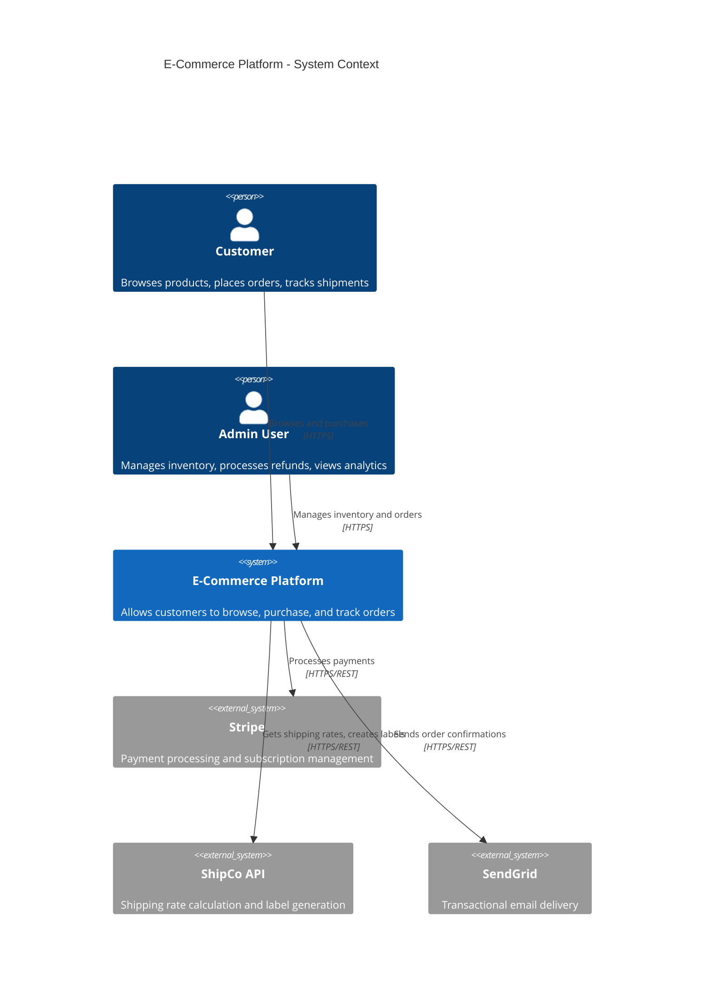
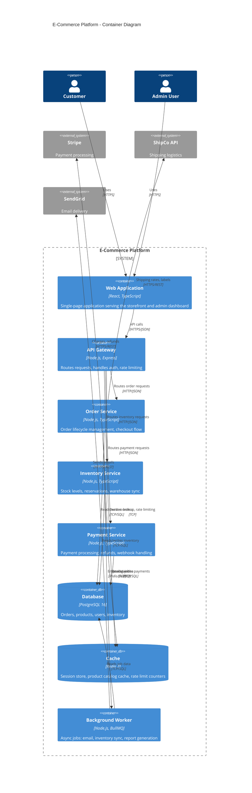

# Example: Creating C4 Model Documentation

## Scenario

A team is documenting the architecture of an e-commerce platform. The system consists of a React SPA, a Node.js API gateway, microservices for orders, inventory, and payments, a PostgreSQL database, a Redis cache, and integrations with Stripe and a third-party shipping provider. The documentation needs to serve both engineering leadership (for architecture reviews) and the development team (for onboarding).

## Prompt

"Create C4 model documentation for our e-commerce platform. Include System Context (Level 1) and Container (Level 2) diagrams in Mermaid syntax. The system has a React SPA, Node.js API gateway, order/inventory/payment services, PostgreSQL, Redis, and external integrations with Stripe and ShipCo. Show all relationships with protocols."

## Expected Output

### Document Index

| Document | Level | Audience |
|---|---|---|
| System Context Diagram | C4 Level 1 | Leadership, architects, new engineers |
| Container Diagram | C4 Level 2 | Engineers, DevOps, architects |
| Deployment View | Infrastructure | DevOps, SRE |

---

### C4 Level 1: System Context Diagram

#### Context Diagram Narrative

The E-Commerce Platform serves two primary actors: customers who browse and purchase products, and admin users who manage inventory and process orders. The system depends on three external services: Stripe for payment processing, ShipCo for shipping logistics, and SendGrid for transactional email. All external communications occur over HTTPS.

---

### C4 Level 2: Container Diagram

#### Container Diagram Narrative

The platform is composed of eight containers within the system boundary:

1. **Web Application (React SPA)** — serves the customer storefront and admin dashboard. Communicates exclusively with the API Gateway.
2. **API Gateway (Express)** — authenticates requests, enforces rate limits, and routes to domain services. No business logic resides here.
3. **Order Service** — manages the order lifecycle from cart to fulfillment. Enqueues async jobs (email, shipping labels) to the background worker.
4. **Inventory Service** — tracks stock levels, handles reservations during checkout, and caches the product catalog in Redis.
5. **Payment Service** — wraps Stripe API interactions. Handles webhooks for payment confirmations and refund processing.
6. **PostgreSQL Database** — shared relational store for all domain data. Schema-per-service ownership boundaries enforced by convention.
7. **Redis Cache** — serves three purposes: session storage, product catalog caching, and rate limit counters at the gateway level.
8. **Background Worker (BullMQ)** — processes async jobs including email dispatch, inventory synchronization, and report generation.

---

### Technology Decisions Summary

| Container | Technology | Rationale |
|---|---|---|
| Web Application | React + TypeScript | Team expertise, component ecosystem |
| API Gateway | Express | Lightweight, middleware-oriented |
| Domain Services | Node.js + TypeScript | Shared language with frontend, strong typing |
| Database | PostgreSQL 16 | ACID compliance, JSONB for flexible data |
| Cache | Redis 7 | Sub-millisecond reads, native pub/sub for BullMQ |
| Job Queue | BullMQ | Redis-backed, built-in retry and backoff |

### Diagram Key

| Shape | Meaning |
|---|---|
| Person | External human actor |
| Container | A deployable unit (application, service, database) |
| ContainerDb | A data store (database, cache, file system) |
| System_Boundary | The boundary of the system being documented |
| System_Ext | An external system outside our control |
| Rel (solid arrow) | A runtime dependency with protocol label |

## Key Decisions

- **Mermaid C4 syntax** — renders in GitHub, GitLab, and most documentation tools without external dependencies.
- **Protocols on all relationships** — every arrow is labeled with the communication protocol, removing ambiguity.
- **Narrative accompanies each diagram** — diagrams show structure, narratives explain intent and constraints.
- **System boundary clearly drawn** — distinguishes internal containers from external dependencies.
- **Technology labels on every container** — enables infrastructure and security teams to assess the stack at a glance.
