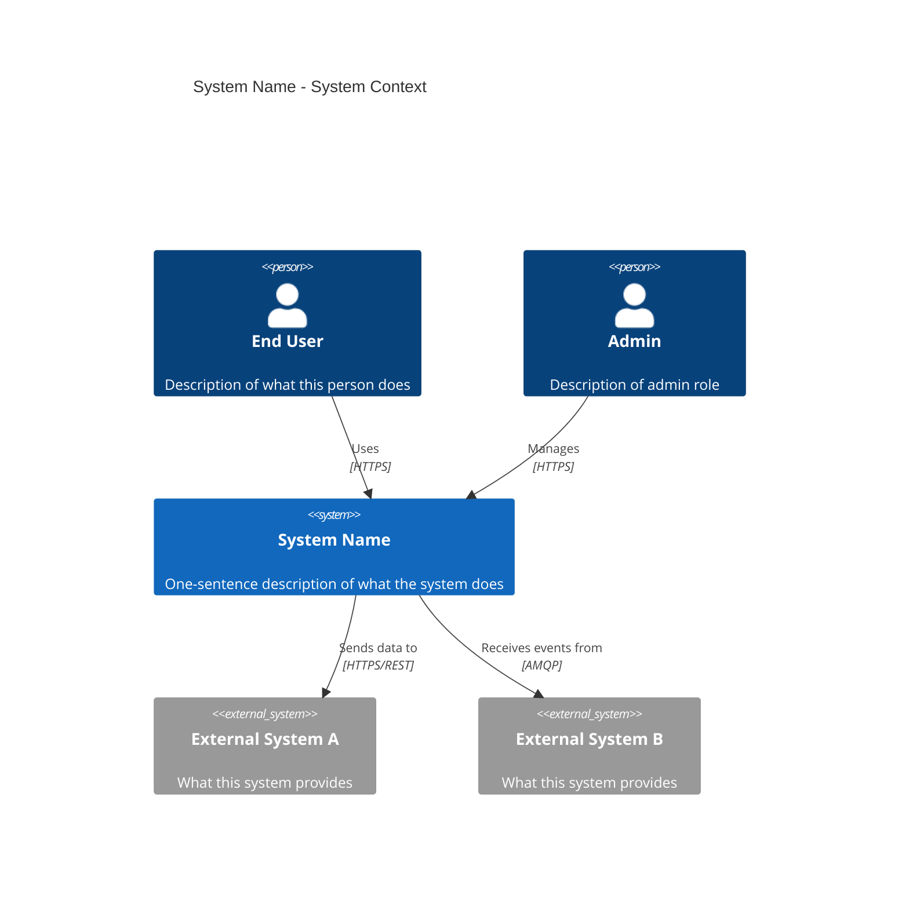
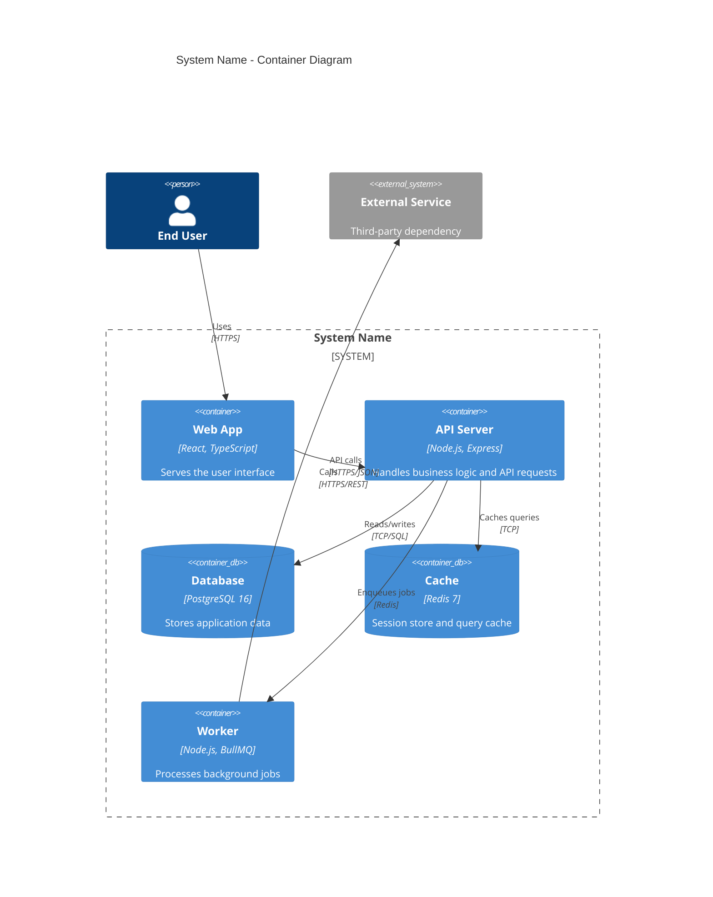
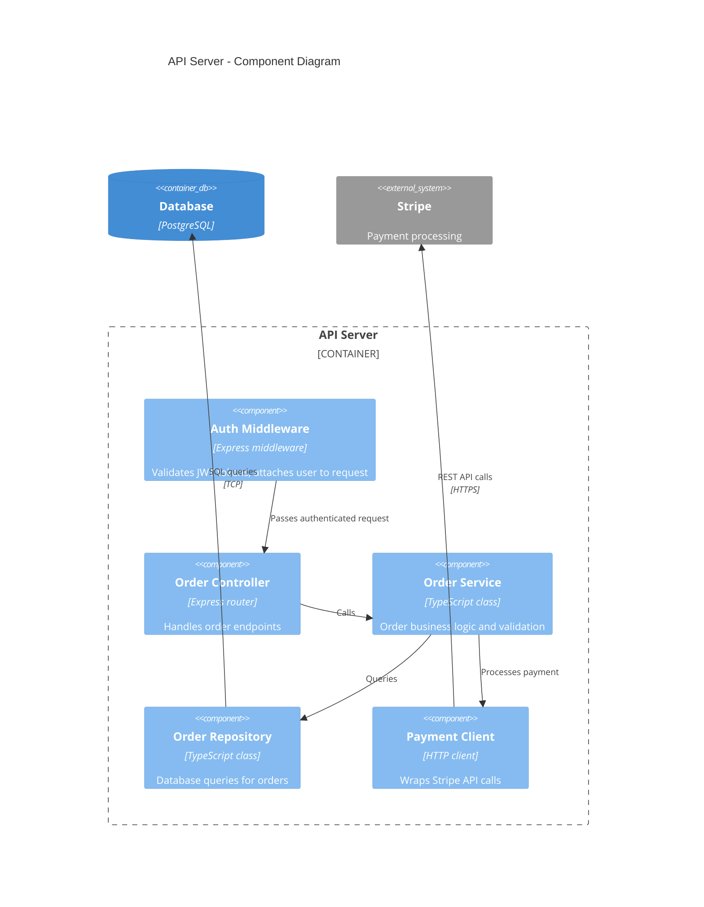

# C4 Modeling

Load this when creating C4 diagrams at any level (Context, Container, Component, Code), choosing diagram notation, or structuring architecture diagrams.

## C4 model overview

The C4 model provides four levels of abstraction for software architecture diagrams:

| Level | Name | Shows | Audience |
|---|---|---|---|
| 1 | System Context | The system and its external actors/dependencies | Everyone: leadership, architects, developers |
| 2 | Container | Deployable units within the system boundary | Architects, developers, DevOps |
| 3 | Component | Major structural components within a container | Developers working on that container |
| 4 | Code | Classes, interfaces, modules within a component | Developers actively modifying the code |

- Always start at Level 1 and work downward.
- Level 3 and 4 are optional — only create them for complex containers that benefit from decomposition.
- Each level answers a different question: Level 1 = "What does the system connect to?", Level 2 = "What is the system made of?", Level 3 = "How is this container structured internally?"

## Level 1: System Context

Shows the system as a single box surrounded by its users and external dependencies.



### Rules

- The system under discussion is always a single box at this level.
- Every external actor (person or system) must be shown.
- Relationships must include the communication protocol or mechanism.
- Do not show internal structure — that belongs at Level 2.

## Level 2: Container

Shows the deployable units inside the system boundary.



### Container types

| Element | Use for |
|---|---|
| `Container` | Applications, services, serverless functions, CLI tools |
| `ContainerDb` | Databases, caches, file stores, message brokers |
| `ContainerQueue` | Message queues (if your tool supports it) |

### Rules

- Every container must have a technology label.
- Relationships must show what data flows and over what protocol.
- System_Boundary groups all internal containers.
- External systems remain outside the boundary as System_Ext.

## Level 3: Component

Shows the internal structure of a single container.



### Rules

- Only decompose containers that are complex enough to warrant it.
- Components are code-level abstractions: controllers, services, repositories, clients.
- Show dependencies between components within the container.
- External containers (database, external systems) appear outside the boundary.

## Diagram notation standards

### Required elements on every diagram

1. **Title** — describes the system and diagram level.
2. **Legend/Key** — explains shapes, colors, line styles (unless using a standard tool like Structurizr that has built-in legends).
3. **Relationship labels** — every arrow must describe what flows and how.
4. **Technology labels** — every container and component must state its technology.

### Color conventions (optional but recommended)

| Color | Meaning |
|---|---|
| Blue | Internal system containers |
| Gray | External systems and actors |
| Green | Databases and data stores |
| Orange | Message brokers and queues |

### Relationship label format

```
"[What is communicated]", "[Protocol]"
```

Examples: `"API calls", "HTTPS/JSON"` or `"Reads/writes orders", "TCP/SQL"`

## Tooling options

| Tool | Format | Rendering |
|---|---|---|
| Mermaid | Markdown code blocks | GitHub, GitLab, Docusaurus, VS Code |
| Structurizr DSL | `.dsl` files | Structurizr Lite (Docker), structurizr.com |
| PlantUML | `.puml` files | PlantUML server, IDE plugins |
| D2 | `.d2` files | CLI renderer, VS Code extension |

- Prefer Mermaid for documentation that lives in Git repositories — renders natively in GitHub/GitLab.
- Use Structurizr DSL for complex architectures where you need multiple views from a single model.
- Store diagram source files alongside the code they describe.

## Common mistakes

- **Mixing abstraction levels** — showing both system context actors and internal code classes on the same diagram.
- **Missing relationships** — every container/component must have at least one incoming or outgoing relationship. Orphaned boxes indicate incomplete documentation.
- **No technology labels** — shapes without technology labels are ambiguous and fail to communicate the stack.
- **Arrows without labels** — an unlabeled arrow could mean anything. Always state what flows and how.
- **Too many elements** — a diagram with more than 15-20 elements is too complex. Decompose into sub-diagrams at the next level.
