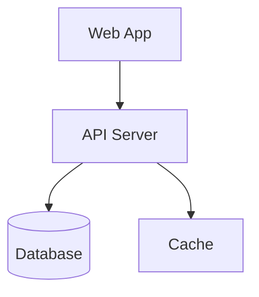

# Documentation Automation

Load this when setting up documentation CI/CD, automating diagram generation, configuring linting, or integrating documentation validation into build pipelines.

## Diagrams as code

Store diagram source files in the repository alongside the code they document. This enables version control, PR reviews, and automated rendering.

### Mermaid in Markdown

```markdown
## System Architecture


```

- GitHub and GitLab render Mermaid natively in Markdown files.
- No external tool installation required for viewing.
- Changes to diagrams appear in PR diffs as text, making reviews easy.

### Structurizr DSL

```dsl
workspace "E-Commerce" {
  model {
    customer = person "Customer"
    ecommerce = softwareSystem "E-Commerce Platform" {
      webapp = container "Web App" "React" "SPA"
      api = container "API" "Node.js" "REST API"
      db = container "Database" "PostgreSQL" "Relational store"
    }
    customer -> webapp "Uses" "HTTPS"
    webapp -> api "Calls" "HTTPS/JSON"
    api -> db "Reads/writes" "SQL"
  }
  views {
    systemContext ecommerce "Context" { include * autoLayout }
    container ecommerce "Containers" { include * autoLayout }
  }
}
```

- Run with `docker run -it --rm -p 8080:8080 -v ./docs:/usr/local/structurizr structurizr/lite`.
- Generates multiple diagram views from a single model definition.
- Export to PNG, SVG, or PlantUML from the web UI.

## CI/CD documentation validation

### Link checking

```yaml
# .github/workflows/docs-check.yml
name: Documentation Check
on: [pull_request]
jobs:
  link-check:
    runs-on: ubuntu-latest
    steps:
      - uses: actions/checkout@v4
      - name: Check markdown links
        uses: gaurav-nelson/github-action-markdown-link-check@v1
        with:
          use-quiet-mode: 'yes'
          config-file: '.markdown-link-check.json'
```

```json
// .markdown-link-check.json
{
  "ignorePatterns": [
    { "pattern": "^https://internal" }
  ],
  "timeout": "10s",
  "retryOn429": true,
  "aliveStatusCodes": [200, 206]
}
```

### OpenAPI spec validation

```yaml
  openapi-lint:
    runs-on: ubuntu-latest
    steps:
      - uses: actions/checkout@v4
      - name: Lint OpenAPI spec
        uses: stoplightio/spectral-action@v0.8.11
        with:
          file_glob: 'docs/api/*.yaml'
          spectral_ruleset: '.spectral.yaml'
```

### ADR format validation

```bash
#!/bin/bash
# scripts/validate-adrs.sh
errors=0
for adr in docs/architecture/decisions/[0-9]*.md; do
  if ! grep -q "## Status" "$adr"; then
    echo "ERROR: $adr missing ## Status section"
    errors=$((errors + 1))
  fi
  if ! grep -q "## Context" "$adr"; then
    echo "ERROR: $adr missing ## Context section"
    errors=$((errors + 1))
  fi
  if ! grep -q "## Decision" "$adr"; then
    echo "ERROR: $adr missing ## Decision section"
    errors=$((errors + 1))
  fi
  if ! grep -q "## Consequences" "$adr"; then
    echo "ERROR: $adr missing ## Consequences section"
    errors=$((errors + 1))
  fi
done
exit $errors
```

## Automated diagram rendering

### Mermaid CLI for static site generation

```bash
# Install mermaid-cli
npm install -g @mermaid-js/mermaid-cli

# Render all .mmd files to SVG
for f in docs/diagrams/*.mmd; do
  mmdc -i "$f" -o "${f%.mmd}.svg" -t dark
done
```

### PlantUML rendering in CI

```yaml
  render-diagrams:
    runs-on: ubuntu-latest
    steps:
      - uses: actions/checkout@v4
      - name: Render PlantUML diagrams
        uses: cloudbees/plantuml-github-action@v1
        with:
          args: -tsvg docs/diagrams/*.puml
      - name: Commit rendered diagrams
        uses: stefanzweifel/git-auto-commit-action@v5
        with:
          commit_message: "docs: auto-render architecture diagrams"
```

## Documentation site generation

### Docusaurus configuration

```javascript
// docusaurus.config.js
module.exports = {
  title: 'Platform Docs',
  tagline: 'Architecture and API documentation',
  themeConfig: {
    navbar: {
      items: [
        { to: '/docs/architecture', label: 'Architecture', position: 'left' },
        { to: '/docs/api', label: 'API', position: 'left' },
        { to: '/docs/adrs', label: 'Decisions', position: 'left' },
      ],
    },
  },
  markdown: {
    mermaid: true,
  },
  themes: ['@docusaurus/theme-mermaid'],
};
```

### Static site deployment

```yaml
  deploy-docs:
    runs-on: ubuntu-latest
    needs: [link-check, openapi-lint]
    steps:
      - uses: actions/checkout@v4
      - run: npm ci && npm run build
        working-directory: docs-site
      - uses: peaceiris/actions-gh-pages@v4
        with:
          github_token: ${{ secrets.GITHUB_TOKEN }}
          publish_dir: docs-site/build
```

## Staleness detection

### Last-updated tracking

```bash
#!/bin/bash
# scripts/check-doc-staleness.sh
STALE_DAYS=90
now=$(date +%s)
for doc in docs/**/*.md; do
  last_modified=$(git log -1 --format="%ct" -- "$doc")
  age_days=$(( (now - last_modified) / 86400 ))
  if [ "$age_days" -gt "$STALE_DAYS" ]; then
    echo "STALE ($age_days days): $doc"
  fi
done
```

### Automated issue creation for stale docs

```yaml
  staleness-check:
    runs-on: ubuntu-latest
    schedule:
      - cron: '0 9 * * 1'  # Every Monday at 9 AM
    steps:
      - uses: actions/checkout@v4
        with:
          fetch-depth: 0
      - name: Check for stale documentation
        run: |
          stale=$(bash scripts/check-doc-staleness.sh)
          if [ -n "$stale" ]; then
            gh issue create --title "Stale documentation detected" \
              --body "The following documents have not been updated in 90+ days:\n\n$stale"
          fi
        env:
          GH_TOKEN: ${{ secrets.GITHUB_TOKEN }}
```

## Ownership metadata

Add frontmatter to every architecture document for tracking:

```yaml
---
title: Order Service Architecture
owner: platform-team
last-reviewed: 2025-03-01
review-cycle: quarterly
status: current
---
```

- Parse frontmatter in CI to enforce review cycles.
- Route staleness alerts to the owning team.
- Include `status: current | draft | deprecated` to filter in documentation site navigation.
